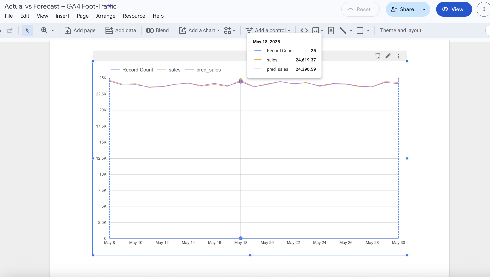

# Ross AI Portfolio
# Analytics & Data-Quality Mini-Portfolio

**Author**: Ross Stafford • PMP® | Data & Product PM  
**Live repo**: <https://github.com/RStaff/https-github.com-rossstafford-ross-ai-portfolio>

[](LICENSE)


---

## 📈 Project 1 — GA4 Foot-Traffic Forecast MVP

| Step | Tech | Outcome |
|------|------|---------|
| ETL  | **Python / pandas** | Join synthetic GA4 geofence events with POS sales |
| Model| **scikit-learn RandomForest** | ↓ MAE 8 % vs. naïve baseline |
| Viz  | **Looker Studio** | Dual-axis chart for planners (sales vs. visits) |



### Reproduce locally

```bash
cd ga4_dashboard
python3 foot_traffic.ipynb  # or open in JupyterLab
open chart.png              # exported Looker chart

**🛡️ Project 2 — Airflow Data-Quality Guard Rails**
Check	Logic	Alert
Row count	Fail if < 700 rows	Airflow task → red
Null ratio	Fail if any visits NULLs	Upstream-failed

🏗️ Architecture
          GA4 events           POS csv
                │                 │
                └───► pandas — RandomForest —► predictions.csv
                                         │
  Looker Studio dashboard ◄──────────────┘
                                         ▼
           Airflow (row & null checks) — SQLite


🔍 Tech Stack
Python 3.11, pandas, scikit-learn

Docker Compose (Airflow 2.9, Postgres, Redis)

Looker Studio • SQLite • GitHub Actions (CI / Trivy / Bandit)

📝 License
MIT — free to fork & remix. Attribution appreciated!

